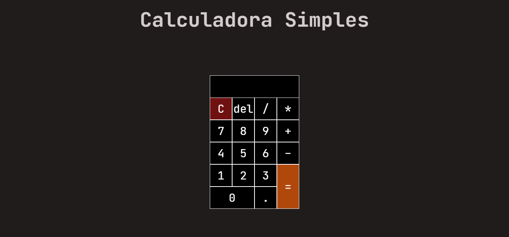
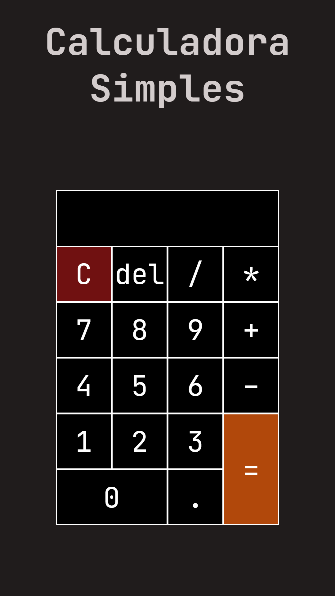
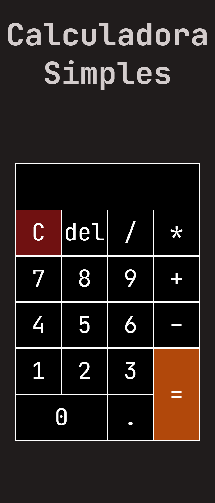
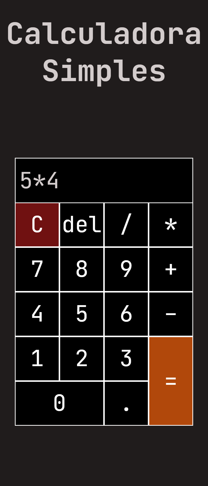

# Calculadora Simples

Mini projeto de uma calculadora que realiza operações matemáticas básicas. Projeto feito utilizando HTML5, CSS3 e Javascript.

## Guia
- [Descrição](#ancora1)
- [Screenshots](#ancora2)
  - [Versão Desktop](#ancora3)
  - [Versão Mobile](#ancora4)

## :pushpin: Descrição

A calculadora é capaz de realizar as quatro operações matemáticas básicas (*adição, subtração, multiplicação e divisão*). A tag de input da calculadora recebe o parâmetro **readonly**, para realçar sua função como visor, e proporcionar uma experiência mais próxima de uma calculadora de fato, pois o usuário poderá apenas passar valores ao clique dos botões.

[Voltar ao Topo](#ancora)

## :camera_flash: Screenshots

### :desktop_computer: Versão Desktop

[Voltar ao Topo](#ancora)

### :iphone: Versão Mobile
Pegaremos como exemplo os aparelhos Moto G4 e Galaxy Fold:

#### Moto G4

   

#### Galaxy Fold

   

[Voltar ao Topo](#ancora)
